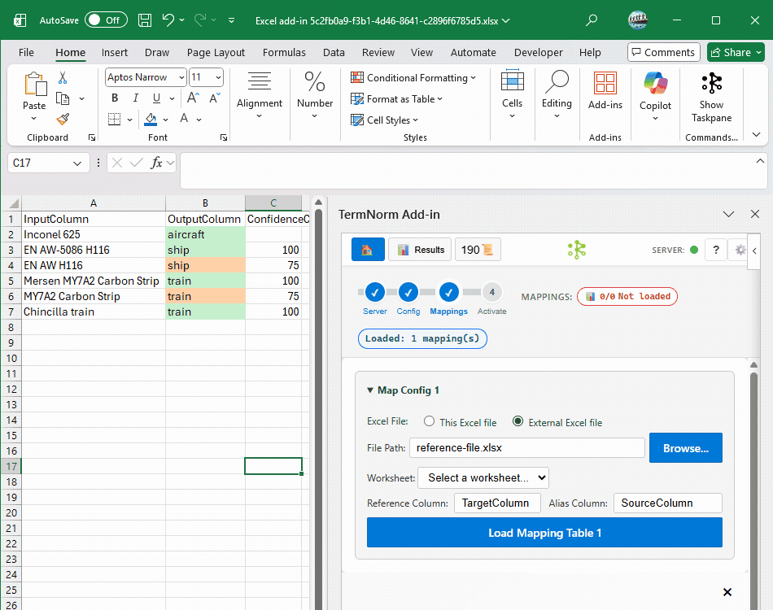
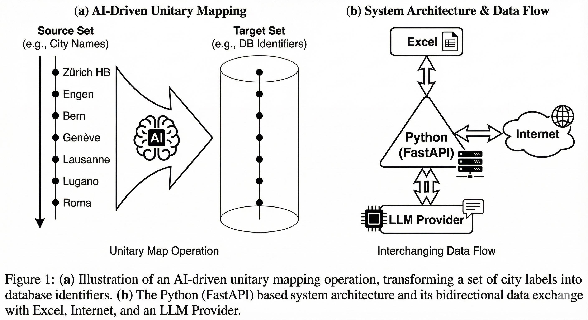

**Keywords:** Python, FastAPI, LLM, Entity Resolution, Excel Automation, Vector Mapping, Database Normalization.

# TermNorm - AI-Powered Database Identifier Assignment for Excel

<p align="center">
  
  
</p>

<p align="center">
  <em>Match free-form text to standardized database identifiers using web research, LLM reasoning, and intelligent ranking</em>
</p>

<p align="center">
  Type in Excel, get results in real-time. Three-tier matching: Cache → Fuzzy → AI research.
</p>

<p align="center">
  
</p>

<p align="center">
  
</p>

## 📚 Documentation

- **[Installation Guide](docs/INSTALLATION.md)** - Setup for end users and IT admins
- **[Setup Guide](docs/SETUP-GUIDE.md)** - How to use the add-in
- **[Developer Guide](docs/DEVELOPER.md)** - Modify the codebase, VS Code setup
- **[Troubleshooting](docs/TROUBLESHOOTING.md)** - Common issues & solutions

## 📋 Use Cases

- **Database Identifier Assignment** - Match free-form names to standardized database identifiers
- **Classification & Terminology Management** - Assign categories to unstructured text
- **Data Normalization & Entity Linking** - Standardize product names, material codes, process terms

> **Built for scale:** Tested against 11,750+ database identifiers with expert-level disambiguation for Life Cycle Assessment (LCA) workflows.

## ✨ Key Features

- **Zero-Click Setup** - Drop config file, start working immediately
- **Transparent Decisions** - Ranked candidates with confidence scores, sources, and full audit trail
- **Direct Prompt** - Custom LLM queries with fuzzy validation against your terms
- **Visual Feedback** - Color-coded cells show match quality at a glance
- **Multi-User Ready** - IP-based auth with hot-reload

## 🚀 Quick Start

### Prerequisites

- Microsoft Excel (Desktop or Microsoft 365)
- Python 3.9+ (for backend server)
- LLM API key (Groq recommended, OpenAI supported)

### For End Users

**👉 [Download from GitHub Releases](https://github.com/runfish5/TermNorm-excel/releases)**

Download `termnorm-deploy-vX.X.X.zip` - contains everything you need:
- ✅ Pre-built frontend (`dist/`)
- ✅ Python backend (`backend-api/`)
- ✅ Manifest files
- ✅ Configuration templates

**Setup:**

1. Extract to your desired location (e.g., `C:\TermNorm-excel\`)
2. Run `start-server-py-LLMs.bat` to start the backend
3. Install the add-in:
   - **Microsoft 365**: Upload `manifest-cloud.xml` via *Home → Add-ins → Upload My Add-in*
   - **Desktop Excel**: Requires network deployment - see [Installation Guide](docs/INSTALLATION.md#3-desktop-excel-deployment-network-sideloading)

<details>
<summary>Manual backend setup (alternative)</summary>

```bash
cd backend-api
python -m venv .venv
.\.venv\Scripts\activate
pip install -r requirements.txt
setx GROQ_API_KEY "your_api_key_here"
python -m uvicorn main:app --reload
```
</details>

## 🖥️ Desktop Excel Deployment (Network Sideloading)

Desktop Excel cannot use the simple cloud upload method. Instead, it requires hosting the add-in on an internal web server (IIS) and distributing the manifest via network shared folder. Users then configure their Trust Center to access the shared catalog.

**This process involves:**
- Extracting the release package (`termnorm-deploy-v1.xx.xx.zip`)
- Deploying to IIS (Windows Server)
- Setting up network share for manifest distribution
- Configuring Trust Center on each user's Excel

📖 **[Complete deployment guide with step-by-step instructions](docs/INSTALLATION.md#3-desktop-excel-deployment-network-sideloading)**

---

## 👨‍💻 For Developers

This project demonstrates a reusable architecture for building Excel add-ins with Python backend servers. This implementation specifically tackles **database identifier assignment**: Matching free-form text entries to standardized terminology using web research, LLM reasoning, and intelligent ranking algorithms.

<p align="center">
  
</p>

**Want to modify this codebase?** Check out the comprehensive developer guide:

### 📘 [Developer Guide](docs/DEVELOPER.md)

**Covers:**
- ✅ **VS Code Office Add-ins Developer Kit** setup
- ✅ Full installation from source (git clone or download)
- ✅ Frontend development (UI customization)
- ✅ Backend development (Python server)
- ✅ Building and deployment
- ✅ Debugging tips and best practices

**Learn Excel Add-ins:**
- [Office Add-ins Overview](https://learn.microsoft.com/en-us/office/dev/add-ins/overview/office-add-ins)
- [Excel JavaScript API Reference](https://learn.microsoft.com/en-us/javascript/api/excel)
- [Sideloading from network share](https://learn.microsoft.com/en-us/office/dev/add-ins/testing/create-a-network-shared-folder-catalog-for-task-pane-and-content-add-ins)

### Quick Start for Developers

```bash
git clone https://github.com/runfish5/TermNorm-excel.git
cd TermNorm-excel
npm install              # Downloads ~900MB to node_modules/ (required for development)
npm run dev-server       # Frontend dev server
# Open another terminal
cd backend-api
python -m venv .venv && .\.venv\Scripts\activate
pip install -r requirements.txt
python -m uvicorn main:app --reload    # Backend server
```

Press `F5` in VS Code with Office Add-ins Developer Kit to start debugging in Excel!

**Note:** The ~1GB local directory size (mostly `node_modules/`) is normal for development. End users who download the deployment package don't need any of this.

---

**Made with ❤️ by Runfish-data** | [GitHub](https://github.com/runfish5/TermNorm-excel) | [Issues](https://github.com/runfish5/TermNorm-excel/issues)
