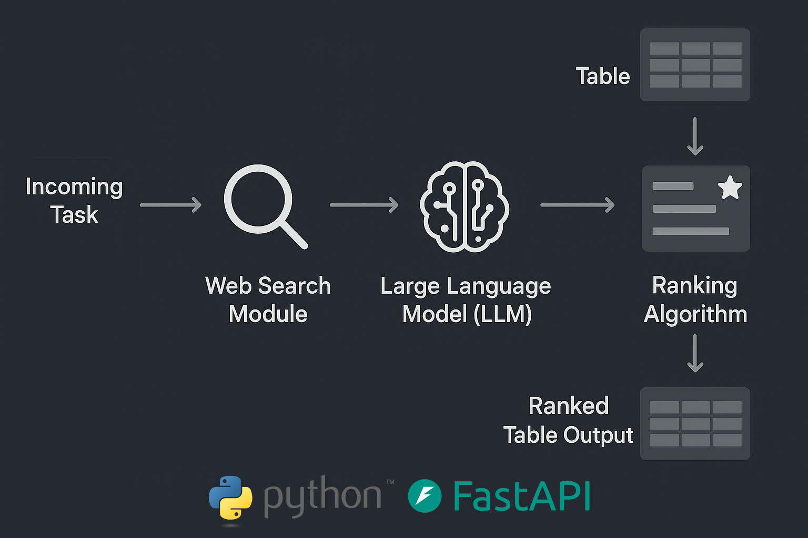
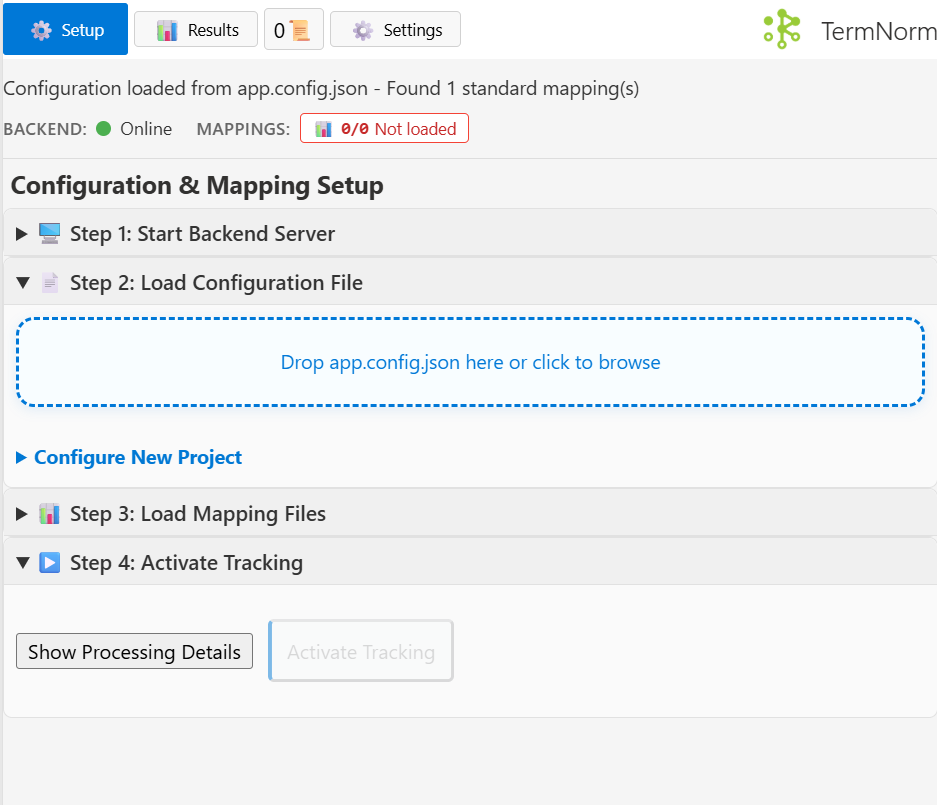

# TermNorm - AI-Powered Terminology Normalization for Excel

<p align="center">
  
</p>

The workflow diagram above shows the Python/FastAPI backend pipeline that powers real-time terminology normalization directly within Excel.

This project demonstrates a reusable architecture for building Excel add-ins with Python backend servers. This implementation specifically tackles **database identifier assignment**: Matching free-form text entries to standardized terminology using web research, LLM reasoning, and intelligent ranking algorithms.

## 📚 Documentation

- **[Installation Guide](docs/INSTALLATION.md)** - Complete setup instructions
- **[Usage Guide](docs/USAGE.md)** - How to use the add-in
- **[Troubleshooting](docs/TROUBLESHOOTING.md)** - Common issues & solutions
- **[Client Installation (German)](docs/CLIENT_INSTALLATION_de.md)** - Standalone deployment guide


## ✨ Key Features

- **Real-time Cell Monitoring** - Automatically detects and processes cell changes
- **AI-Powered Research & Matching** - Web research + LLM ranking + fuzzy matching pipeline
- **Intelligent Candidate Ranking** - Multi-source matching with confidence scoring
- **Simple Configuration** - Single JSON file with drag & drop support
- **Activity Tracking** - In-Excel view of processing history and ranked candidates
- **Persistent Logging** - Comprehensive audit trail of all mapping decisions
- **Flexible Mapping System** - Multiple reference files with hot-reload capability
- **Color-Coded Results** - Visual feedback for normalization status and confidence
- **Multi-User Support** - IP-based authentication with stateless architecture

### Interface Preview

<p align="center">
  
</p>

## 📋 Use Cases

- **Data Normalization & Entity Linking**: Standardize product names, material codes, process terms, and match free-text entities to standardized knowledge bases
- **Classification & Terminology Management**: Assign categories to unstructured text and maintain consistent terminology across documents
- **Database Identifier Assignment**: Assign free-form names to standardized database identifiers

## 💡 How It Works

```
User Input (Excel Cell)
    ↓
1. Quick Lookup (cached exact matches)
    ↓
2. Fuzzy Matching (similarity algorithms)
    ↓
3. LLM Research (web + entity profiling)
    ↓
Ranked Candidates with Confidence Scores
    ↓
Auto-apply or Manual Selection
    ↓
Logging & State Update
```

## 🚀 Quick Start

### Prerequisites

- Microsoft Excel (Desktop or Microsoft 365)
- Python 3.9+
- LLM API key (Groq recommended, OpenAI supported)

### Installation

**1. Clone the repository**
```bash
git clone https://github.com/runfish5/TermNorm-excel.git
cd TermNorm-excel
```

**2. Start backend server**

Simply double-click `start-server-py-LLMs.bat` in the project directory.

**Note:** Changes to `backend-api/config/users.json` are hot-reloaded automatically (no server restart needed).

<details>
<summary>What does the script do?</summary>

The script automatically:
- ✅ Sets up virtual environment
- ✅ Installs all dependencies
- ✅ Chooses deployment type (Local or Network)
- ✅ Runs diagnostics and starts server
</details>

<details>
<summary>Manual setup (alternative)</summary>

```bash
cd backend-api
python -m venv .venv
.\.venv\Scripts\activate
pip install -r requirements.txt

# Set API key
setx GROQ_API_KEY "your_api_key_here"

# Start server
python -m uvicorn main:app --reload                              # Local
python -m uvicorn main:app --host 0.0.0.0 --port 8000 --reload  # Network
```
</details>

**3. Install Excel add-in**
- **Microsoft 365**: Upload `manifest-cloud.xml` via *Home → Add-ins → Upload My Add-in*
- **Desktop Excel**: Sideload `manifest.xml` via Trust Center settings

📖 **[Full Installation Guide](docs/INSTALLATION.md)** | **[Client Setup Guide](CLIENT_INSTALLATION.md)**

---

## 🖥️ Windows Server Deployment (Internal Network)

**For deploying to Windows Server for internal/enterprise use:**

This is the **standard Microsoft-recommended approach** for internal network deployment using:
- ✅ **IIS** (built into Windows Server) for static file hosting
- ✅ **Network shared folder catalog** for sideloading
- ✅ **HTTP hosting** on internal network (HTTPS optional)

### Quick Setup (3 Steps):

**1. Build for HTTP deployment**

From the project directory:
```bash
cd C:\path\to\TermNorm-excel
build-http.bat
```
This rebuilds `dist/` with URLs pointing to `http://localhost:8080/`

**2. Deploy to IIS** *(run as Administrator)*
```bash
setup-iis.bat
```
This automatically:
- Creates IIS website at `C:\inetpub\wwwroot\termnorm\`
- Configures HTTP hosting on port 8080
- Tests the deployment

**3. Sideload in Excel**
- Copy manifest: `copy C:\inetpub\wwwroot\termnorm\manifest.xml C:\OfficeAddIns\`
- In Excel: **Insert → Get Add-ins → SHARED FOLDER → TermNorm**

### Configuration Updates

When you edit `config/app.config.json`:
1. Navigate to project directory: `cd C:\path\to\TermNorm-excel`
2. Run `build-http.bat` to rebuild with new config
3. Run `setup-iis.bat` to redeploy to IIS
4. Restart Excel to load updated configuration

📖 **[Detailed Windows Deployment Guide](docs/INSTALLATION.md#windows-server-deployment)**

---

## ⚙️ Configuration

TermNorm uses a single JSON configuration file that defines column mappings and reference data sources.

### Example `app.config.json`

```json
{
  "excel-projects": {
    "MyWorkbook.xlsx": {
      "column_map": {
        "FreeText_Column": "Standardized_Column",
        "Material_Input": "Material_ISO"
      },
      "default_std_suffix": "standardized",
      "standard_mappings": [
        {
          "mapping_reference": "C:\\Reference\\Materials.xlsx",
          "worksheet": "StandardTerms",
          "source_column": "",
          "target_column": "ISO_Standard"
        },
        {
          "mapping_reference": "C:\\Reference\\Processes.xlsx",
          "worksheet": "ProcessList",
          "source_column": "",
          "target_column": "BFO_Term"
        }
      ]
    }
  }
}
```

### Loading Configuration

**Microsoft 365**: Drag & drop `app.config.json` into the TermNorm task pane

**Desktop Excel**: Save config to `config/app.config.json` and click **Load Config**

### Multi-User Setup

Edit `backend-api/config/users.json` to add users:

```json
{
  "users": {
    "admin": {
      "email": "admin@company.com",
      "allowed_ips": ["127.0.0.1", "192.168.1.100"]
    },
    "user2": {
      "email": "user2@company.com",
      "allowed_ips": ["192.168.1.101"]
    }
  }
}
```

## 🏗️ Architecture

### Frontend Structure

```
src/
├── taskpane/              # Application orchestrator
├── services/              # Business logic layer
│   ├── live.tracker.js    # Multi-workbook cell monitoring
│   ├── normalizer.functions.js  # Normalization pipeline
│   └── normalizer.fuzzy.js      # Fuzzy matching
├── ui-components/         # UI component functions
├── utils/                 # Helper utilities
│   ├── api-fetch.js       # Centralized API communication
│   ├── error-display.js   # Message display system
│   └── server-utilities.js     # Server connection management
└── shared-services/       # State management
    └── state-machine.manager.js
```

### Backend Structure

```
backend-api/
├── main.py                # FastAPI app + routers
├── config/                # Configuration & middleware
│   ├── users.json         # IP-based authentication
│   └── middleware.py      # Auth middleware
├── api/                   # API endpoints
│   ├── system.py          # Health & logging
│   └── research_pipeline.py    # Research & match endpoint
├── core/                  # Core functionality
│   ├── llm_providers.py   # LLM configuration
│   └── user_manager.py    # Authentication
└── research_and_rank/     # Matching algorithms
```

## 🚨 Troubleshooting

### Server Not Connecting

1. Check server status: `http://127.0.0.1:8000/health`
2. Verify Server URL in Settings tab
3. Check IP permissions in `backend-api/config/users.json`
4. Restart backend server

### LLM Requests Failing

1. Verify API key is set: `echo %GROQ_API_KEY%`
2. Check internet connection
3. Verify API quota/credits
4. Check backend logs for detailed errors

### Configuration Not Loading

1. Validate JSON syntax: https://jsonlint.com
2. Check workbook name matches Excel filename exactly
3. Verify file paths use double backslashes: `C:\\Path\\File.xlsx`
4. Reload configuration

📖 **[Full Troubleshooting Guide](docs/TROUBLESHOOTING.md)**

## 🎯 Known Limitations

- **Single Excel Instance Per Project**: Each file runs isolated add-in instance
- **LLM Request Payload**: Sends full terms array (~50KB for 1000 terms)
  - Trade-off: Larger payloads for zero state management complexity

## 📄 License

Open Source

## 🤝 Code Quality Standards

- **See [CLAUDE.md](CLAUDE.md) for architecture principles**

This project uses a pragmatic, service-based architecture with minimal abstraction.


---

**Made with ❤️ by Runfish-data** | [GitHub](https://github.com/runfish5/TermNorm-excel) | [Issues](https://github.com/runfish5/TermNorm-excel/issues)
