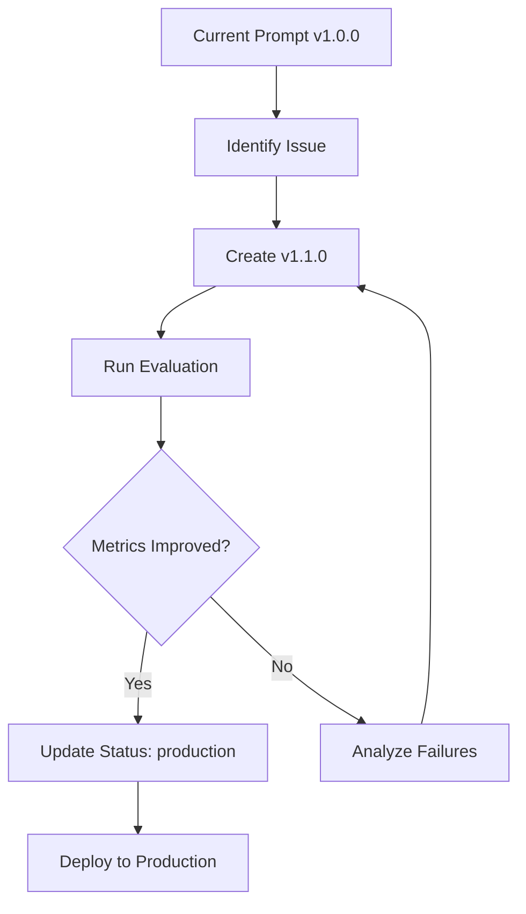

# Evaluation System Quick Start

Get up and running with prompt evaluation in 5 minutes.

## 🎯 Goal

Evaluate and compare different LLM prompt versions for the research pipeline to ensure quality and track improvements.

## 📦 What's Included

1. **Prompt Versioning** - Manage multiple prompt versions with metadata
2. **Test Datasets** - Pre-built test cases for both pipeline stages
3. **Evaluation Metrics** - Quantitative measurements for prompt performance
4. **Comparison Tools** - Side-by-side version comparison

## 🚀 Quick Start

### Step 1: Run Your First Evaluation

```bash
cd backend-api
python evaluation/evaluate_prompts.py
```

This will:
- Load the latest prompt versions
- Run test cases for both entity profiling and candidate ranking
- Display aggregate metrics
- Save detailed reports to `evaluation/results/`

**Expected Output:**
```
✓ Loaded 5 test cases for entity_profiling
📊 Evaluating entity profiling prompt v1.0.0...
  [1/5] Evaluating: stainless steel 304
  [2/5] Evaluating: anodizing aluminum
  ...

============================================================
  ENTITY PROFILING EVALUATION SUMMARY
============================================================
Version: v1.0.0
Prompt: Entity Profiling - Comprehensive Technical Database API
Test Cases: 5

Aggregate Metrics:
  Completeness: 85.0%
  Core Concept Accuracy: 80.0%
  Synonym Coverage: 75.0%
  Array Richness: 6.5 items/array
============================================================
```

### Step 2: Create a New Prompt Version

Let's say you want to improve synonym extraction. Create a new version:

```bash
# Copy current version
cp prompts/entity_profiling/v1.0.0.json prompts/entity_profiling/v1.1.0.json
```

Edit `v1.1.0.json` and modify the prompt template:
```json
{
  "version": "1.1.0",
  "name": "Entity Profiling - Enhanced Synonyms",
  "description": "Added explicit technical abbreviation extraction",
  "status": "experimental",
  "prompt_template": "...ADD YOUR CHANGES HERE..."
}
```

### Step 3: Compare Versions

```bash
python evaluation/evaluate_prompts.py --stage entity_profiling --versions 1.0.0 1.1.0
```

**Output:**
```
============================================================
  ENTITY PROFILING EVALUATION SUMMARY
============================================================

🏆 Best Version: v1.1.0
📊 Best version v1.1.0 shows 12.5% improvement over v1.0.0

Ranking:
  1. v1.1.0: Entity Profiling - Enhanced Synonyms
     Score: 0.892
  2. v1.0.0: Entity Profiling - Comprehensive Technical Database API
     Score: 0.792
============================================================
```

### Step 4: Add Your Own Test Case

Add a line to `evaluation/datasets/entity_profiling_test_cases.jsonl`:

```json
{
  "query": "M10 x 1.5 hex bolt zinc plated",
  "expected_profile": {
    "core_concept": "fastener",
    "synonyms": ["M10 bolt", "hex head bolt", "hexagon bolt", "metric bolt"],
    "specifications": ["M10 thread", "1.5mm pitch", "zinc plated finish"],
    "material_properties": ["zinc coating", "corrosion resistant"]
  },
  "notes": "Tests metric thread specification extraction and finish identification"
}
```

Run evaluation again to see how your prompts handle the new test case.

## 📊 Understanding Metrics

### Entity Profiling

| Metric | Good | Excellent | What It Means |
|--------|------|-----------|---------------|
| Completeness | >70% | >85% | How many schema fields are populated |
| Core Concept Accuracy | >75% | >90% | Correctly identifies the fundamental concept |
| Synonym Coverage | >60% | >80% | Finds expected synonyms and variations |
| Array Richness | >5 | >8 | Average items per array field |

### Candidate Ranking

| Metric | Good | Excellent | What It Means |
|--------|------|-----------|---------------|
| MRR | >0.70 | >0.85 | First result is relevant |
| Precision@3 | >0.60 | >0.80 | Top 3 contain good matches |
| NDCG@5 | >0.70 | >0.85 | Ranking quality with position weighting |
| Rank Correlation | >0.65 | >0.80 | Order matches expected ranking |

## 🎯 Common Use Cases

### Use Case 1: Fix Low Synonym Coverage

**Problem**: Synonym coverage at 45%

**Solution**:
1. Review detailed results to see which synonyms are missing
2. Add explicit instruction: "Include ALL technical abbreviations and trade names"
3. Create v1.1.0 with enhanced synonym extraction
4. Compare: `--versions 1.0.0 1.1.0`
5. If improved, update status to "production"

### Use Case 2: Improve Core Concept Accuracy

**Problem**: Core concept accuracy at 60%

**Solution**:
1. Check test case notes for patterns in failures
2. Refine core concept instructions with better examples
3. Add constraint: "Output ONLY ONE WORD for core concept"
4. Test on all cases
5. Review detailed results for remaining failures

### Use Case 3: Better Category Separation in Ranking

**Problem**: Materials getting high scores when query is a process

**Solution**:
1. Enhance category mismatch penalty in prompt
2. Add examples: "If query is 'cutting' (process), 'steel sheet' (material) must score <2"
3. Create test cases with cross-category candidates
4. Verify score accuracy metrics

## 🔄 Workflow Summary



## 🛠️ Advanced Usage

### Test Specific Queries

Temporarily add test case, run evaluation, then remove:
```bash
# Add test case to .jsonl file
python evaluation/evaluate_prompts.py
# Review results
# Remove test case if not needed permanently
```

### Batch Version Comparison

Compare all available versions:
```bash
python evaluation/evaluate_prompts.py --compare
```

### Export Results for Analysis

Results are saved as JSON in `evaluation/results/`:
```bash
ls -lt evaluation/results/
# Import into Excel, Pandas, or other tools for deeper analysis
```

## 📝 Best Practices

1. **Always test before production**: Never deploy a new prompt version without evaluation
2. **Document changes**: Fill in the "description" and "notes" fields
3. **Keep test cases updated**: Add real-world queries that expose issues
4. **Track metrics over time**: Save evaluation reports to monitor progress
5. **Use semantic versioning**: Major.Minor.Patch for clear version history

## 🚨 Troubleshooting

### "No prompt versions found"
- Check that version files exist in `prompts/entity_profiling/` or `prompts/candidate_ranking/`
- Ensure files are named `vX.Y.Z.json`

### "Failed to load versioned prompt"
- Validate JSON syntax: `python -m json.tool prompts/entity_profiling/v1.0.0.json`
- Check required fields: version, prompt_template, parameters

### Evaluation takes too long
- Reduce test cases temporarily
- Use `--stage entity_profiling` to test one stage at a time
- Test on single version first: `--versions 1.0.0`

## 📚 Next Steps

1. Read the full [README.md](README.md) for detailed documentation
2. Explore the metrics modules in `evaluation/metrics/`
3. Review the prompt loader in `prompts/prompt_loader.py`
4. Check the pipeline integration in `api/research_pipeline.py`

## 💡 Pro Tips

- **Start small**: Test one change at a time
- **Use real data**: Add test cases from production queries that failed
- **Compare incrementally**: v1.0.0 → v1.1.0 → v1.2.0, not v1.0.0 → v2.0.0
- **Document learnings**: Add notes about what worked and what didn't
- **Version everything**: Even experimental prompts should have version numbers

---

**Ready to evaluate?** Run `python evaluation/evaluate_prompts.py` now!
